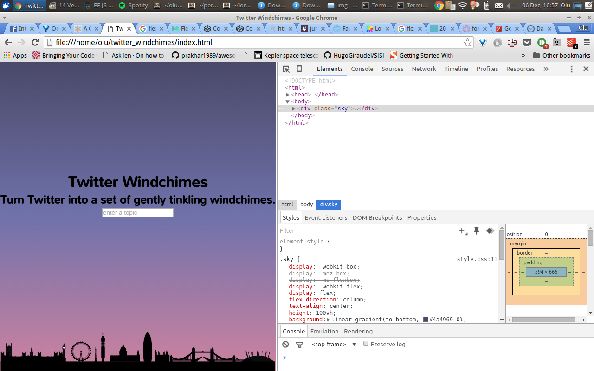
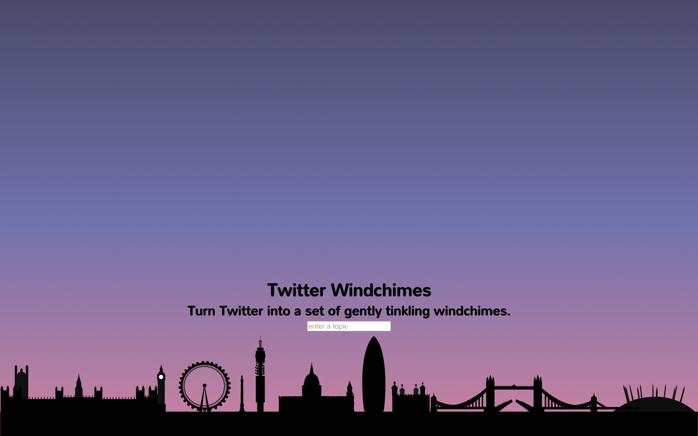

A pretty frustrating day but one that reminds me that I really love programming.

I discovered [codeplayer](http://thecodeplayer.com/) today as I had a design idea for [Twitter Windchimes](https://github.com/oluoluoxenfree/twitter_windchimes); moving clouds in the background that move faster depending on how many times your keywords are picked up. I wonder how crediting goes for CSS, but I'm inspired by [these](http://thecodeplayer.com/walkthrough/make-a-simple-cloud-in-css3) [two](http://thecodeplayer.com/walkthrough/pure-css3-animated-clouds-background) codeplayers. I never knew you code use `:before:` and `:after` to create such cool effects.

In the end I never even got onto the clouds; I put in a [gradient background](http://codepen.io/zessx/pen/rDEAl/) to simulate dusk and spent a long time fiddling with the spacing of elements as the tricks I learnt about flexbox spacing weren't working. I coded for about three hours somehow, completely lost track of time.

Tomorrow I'll tackle the logic again - I think alternation is probably best as I love styling too much. I'm annoyed/amused because I spent so long trying to fix it so the SVG was fixed to the bottom and the text and input was in the middle, then thought I'd fixed it:

And then I swapped out of inspector view:

;_;

Do you like my design? Could you have done this layout in your sleep? Let me know in the comments.
